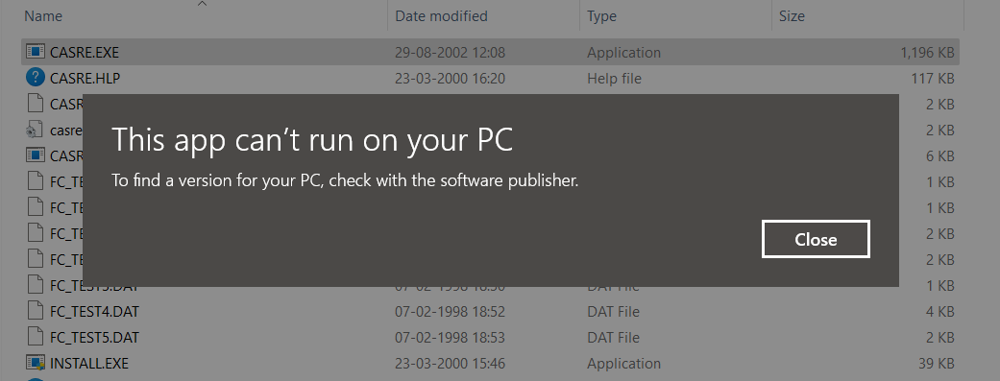

# SENG-637 Assignment 5

**Topic** - Software Reliability Assessment

## Table of Contents

- [Introduction](#introduction)
- [Video demo](#video-demo)
- [Assessment using Reliability Growth Testing](#assessment-using-reliability-growth-testing)
- [Assessment using Reliability Demonstration Chart](#assessment-using-reliability-demonstration-chart)
- [Comparison of results](#comparison-of-results)
- [Similarity and Differences between the two techniques](#similarity-and-differences-between-the-two-techniques)
- [Division of team work](#division-of-team-work)
- [Difficulties, challenges, and lessons learned](#difficulties-challenges-and-lessons-learned)
- [Comments and feedback](#comments-and-feedback)
- [Contributors](#contributors)

## Introduction

## Video demo

Link to the video demonstration of killed/surviving mutants and is _TBA_.

## Assessment using Reliability Growth Testing

## Assessment using Reliability Demonstration Chart

## Comparison of results

## Similarity and Differences between the two techniques
The reliability demonstration chart and reliability growth testing are two different methods that measures reliability statistics, but are based on different parameters. 

The reliability demonstration chart failure intensity objective has or has not been met and it is based on the willingness of the customer and developer to accept of falsely saying the failure intensity objective is met when it is not.

Reliability growth testing, on the otherhand, helps to predict the failure curve through pre-defined failure curve models.

Although they are used for different purposes, they both rely on the inter-failure times or MTTF.

## Division of team work

## Difficulties, challenges, and lessons learned

1. While choosing tools for reliability testing, we had some difficulties in getting the right tool for our project.

   - Our group first decided to test **SRTAT-SRE-tool**. This tool could import the sample data files but couldn't import the target data file. There wasn't any documentation available for the tool either, on how to use it and what input formats it supports.

   - Then we tested **CASRE**. This tool couldn't even launch on 64-bit Windows 11 machine. Every executable we tried threw below error.
     

   - Finally, we tested **C-SFRAT** and it worked fine.

## Comments and feedback

1. The assignment description document [`Assignment5.md`](Assignment5.md) is very detailed and comprehensive, and it was easy to follow.

## Contributors

We are group 5, and below are the team members

- [Bhavyai Gupta](https://github.com/zbhavyai)
- [Drew Burritt](https://github.com/dburritt)
- [Michael Man Yin Lee](https://github.com/mlee2021)
- [Okeoghenemarho Obuareghe](https://github.com/oobuareghe)
