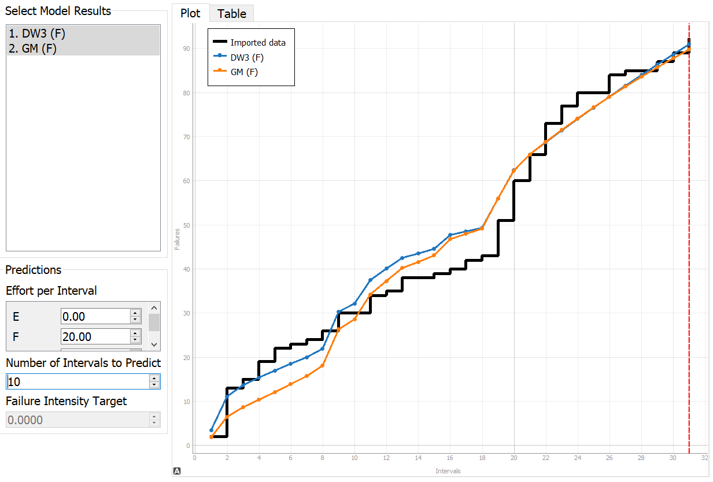
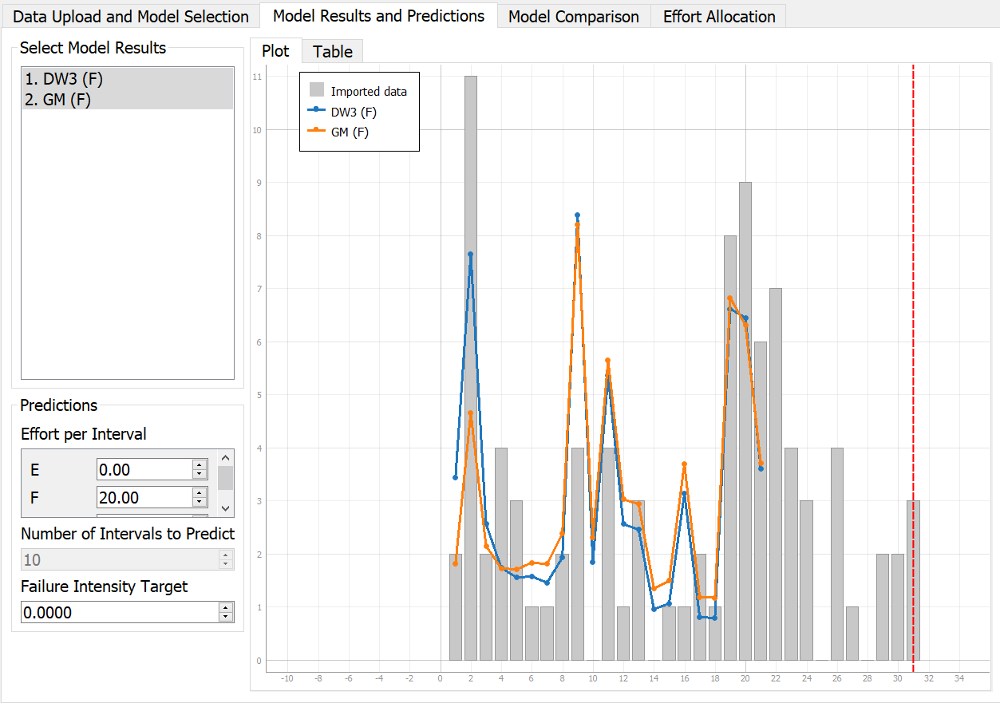
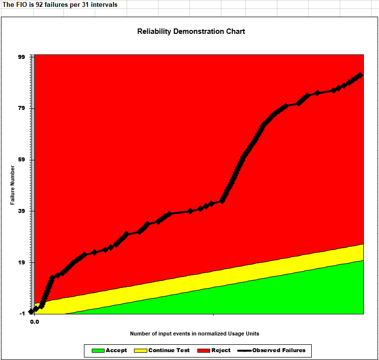
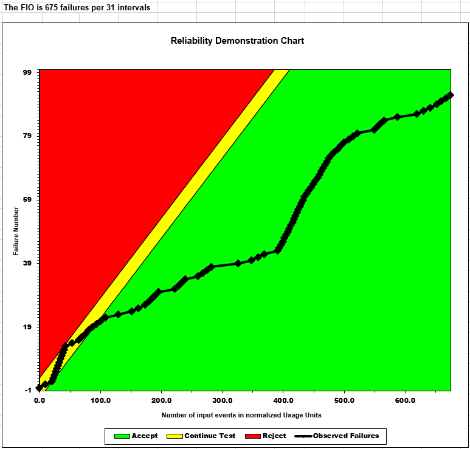
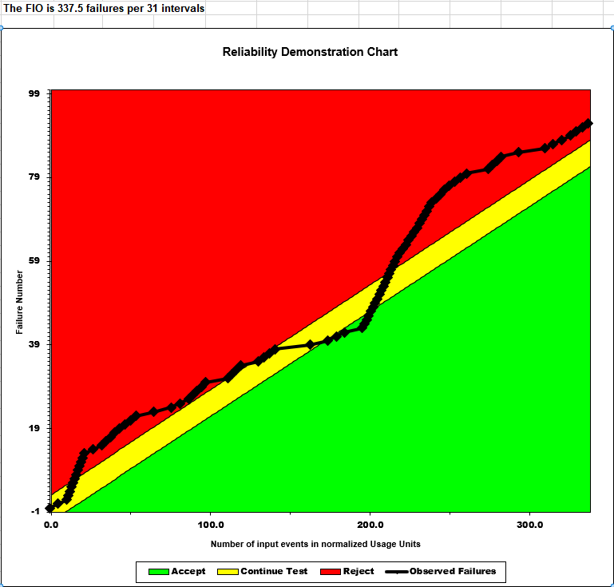
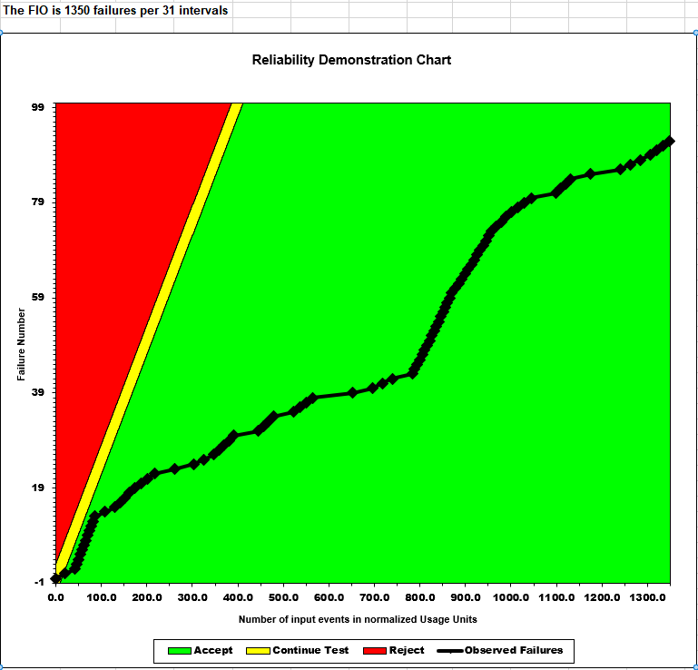

# SENG-637 Assignment 5

**Topic** - Software Reliability Assessment

## Table of Contents

- [Introduction](#introduction)
- [Video demo](#video-demo)
- [Assessment using Reliability Growth Testing](#assessment-using-reliability-growth-testing)
- [Assessment using Reliability Demonstration Chart](#assessment-using-reliability-demonstration-chart)
- [Comparison of results](#comparison-of-results)
- [Similarity and Differences between the two techniques](#similarity-and-differences-between-the-two-techniques)
- [Division of team work](#division-of-team-work)
- [Difficulties, challenges, and lessons learned](#difficulties-challenges-and-lessons-learned)
- [Comments and feedback](#comments-and-feedback)
- [Contributors](#contributors)

## Introduction

## Video demo

Link to the video demonstration of killed/surviving mutants and is _TBA_.

## Assessment using Reliability Growth Testing

For Reliability Growth Testing, after testing the tools suggested by the assignment guideline, we decided to utilize the tool C-SFRAT. The reason for choosing C-SFRAT is because the tool has a very user-friendly way to compare the models with different combinations of covariates.

For C-SFRAT, our approach is to first run the entire set of failure data with every model and covariate combination possible, and then figure out which model is best suitable for the behavior of the failure data. (see model_comparison.csv).

For comparing the models, we will be using the AIC and BIC criterias that is computed by C-SFRAT, which are widely used in model selection. The model with the best AIC should have the greatest amount of variation using the fewest possible independent variables, and the lower the AIC score, the better. (source: https://www.scribbr.com/statistics/akaike-information-criterion/#:~:text=The%20AIC%20function%20is%202K,it%20is%20being%20compared%20to)

BIC, on the otherhand, provides a good estimation on the performance of the model for future data and is also the lower the BIC score the better (source: https://stanfordphd.com/BIC.html)

After analyzing the Model Comparison tables from CS-FRAT, we have found the models Discrete Weibull Type 3 with covariate F is the best model with AIC of 122.199 and BIC of 127.935. The second best model is Geometric Model with covariate F with AIC of 125.323 and BIC of 129.625.

After testing with the various ranges on these models, we have found that using subset of 21 out of the full set of 31 (approximately 67-70% of the full failure dataset) and setting the Covariate F as 20 efforts per interval gave us the best performance of the models.

One of the reason that we can think of is that from the 20th interval there has been a huge up-climb of failures and as such using only the subset before interval 20 will not effectively predict the failures with the models.

Time to Failure Plot of the two models:

Intensity Plot

## Assessment using Reliability Demonstration Chart
The RDC-11 Excel sheet was used for plotting RDC graphs. As it was only configured to plot 16 failures it had to be modified for this data. 
The default risk profile was used:

-Discrimination Ratio (γ) = 2  
-Developer's Risk (α) = 0.1   
-User's Risk (β) = 0.1  

The first plot below shows the RDC graph using the calculated MTTF of the SUT, FIO = 92 failures/31 intervals = 2.97,  giving MTTF = 1/2.97 = 0.337

The second plot is the minimum MTTF for the system to be considered acceptable. This minimum was determined by changing the FIO until a minimum was found; where the SUT barely enters the accept region. It was determined the FIO was 675/31 = 21.77 failures per interval. Giving a MTTF of 0.046. 

The third  plot is  double the minimum MTTF. This gives a MTTF of 0.092 and a FIO of 337.5/31 = 10.89 failures per inteval. In this case the SUT almost immediately goes into the reject region.

The fourth plot is half the minimum MTTF. This gives a MTTF of 0.023 and a FIO of 1350/31 = 43.55 failures per inteval. In this case the SUT immediately goes into the accept region.

Initial RDC plot

MTTFmin RDC plot

MTTFmin doubled RDC plot

MTTFmin half RDC plot

## Comparison of results

## Similarity and Differences between the two techniques

The reliability demonstration chart and reliability growth testing are two different methods that measures reliability statistics, but are based on different parameters.

The reliability demonstration chart failure intensity objective has or has not been met and it is based on the willingness of the customer and developer to accept of falsely saying the failure intensity objective is met when it is not.

Reliability growth testing, on the otherhand, helps to predict the failure curve through pre-defined failure curve models.

Although they are used for different purposes, they both rely on the inter-failure times or MTTF.

## Division of team work

Michael worked on the Assessment using "Reliability Growth Testing" and the "Similarity and Differences between the two techniques" sections.

## Difficulties, challenges, and lessons learned

1. While choosing tools for reliability testing, we had some difficulties in getting the right tool for our project.

   - Our group first decided to test **SRTAT-SRE-tool**. This tool could import the sample data files but couldn't import the target data file. There wasn't any documentation available for the tool either, on how to use it and what input formats it supports.

   - Then we tested **CASRE**. This tool couldn't even launch on 64-bit Windows 11 machine. Every executable we tried threw below error.
     

   - Finally, we tested **C-SFRAT** and it worked fine.

## Comments and feedback

1. The assignment description document [`Assignment5.md`](Assignment5.md) is very detailed and comprehensive, and it was easy to follow.

## Contributors

We are group 5, and below are the team members

- [Bhavyai Gupta](https://github.com/zbhavyai)
- [Drew Burritt](https://github.com/dburritt)
- [Michael Man Yin Lee](https://github.com/mlee2021)
- [Okeoghenemarho Obuareghe](https://github.com/oobuareghe)
